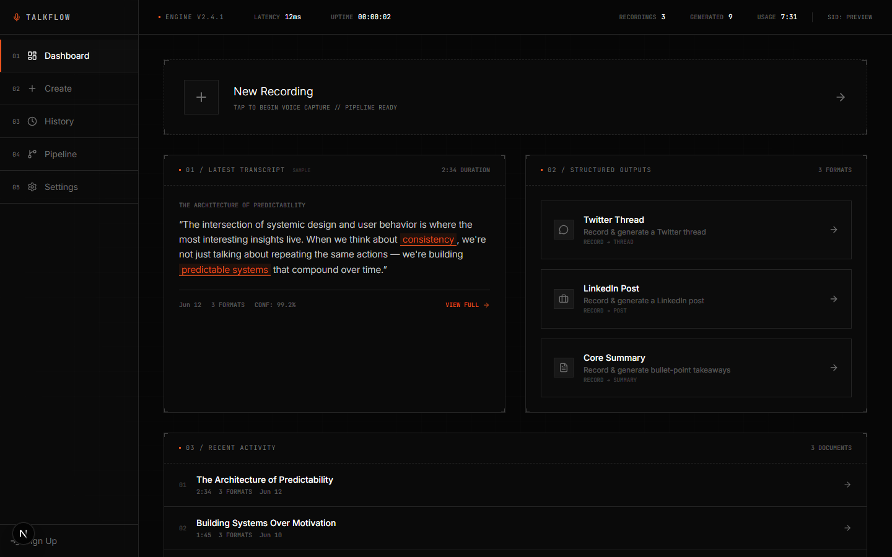

<div align="center">

# TalkFlow

**Voice-to-content SaaS that turns raw speech into publish-ready content.**

Record your thoughts — get Twitter threads, LinkedIn posts, and summaries in seconds.

[](https://nextjs.org/)
[](https://react.dev/)
[](https://www.typescriptlang.org/)
[](https://tailwindcss.com/)
[](https://groq.com/)
[](https://stripe.com/)
[](https://clerk.com/)

[Live Demo](https://talkflow-five.vercel.app) · [Try Without Account](https://talkflow-five.vercel.app/preview)

</div>

---



## Reviewer Quick Read

1. Record speech or use preview mode to enter the product without creating an account.
2. `/api/process` combines transcription and generation into one server-side content pipeline.
3. Clerk handles auth, Stripe handles billing, and Prisma/Supabase handle persistence and storage.
4. This repo proves AI-enabled SaaS productization more than orchestration depth or evaluation rigor.

## What This Repo Proves

- Auth, billing, storage, and AI feature delivery in one cohesive product flow
- Multi-step media -> transcript -> content workflow with a usable public preview
- Product-minded packaging around onboarding, pricing, and upgrade paths

## Honest Scope Boundaries

- Runtime AI calls use Groq through an OpenAI-compatible client and expect `GROQ_API_KEY`.
- `promptfooconfig.yaml` is an exploratory artifact, not a full regression-grade eval harness.
- Current automated tests focus on landing/demo UX and flow sanity, not deep backend reliability assertions.

## Features

- **Voice capture** — browser-native recording with real-time waveform
- **AI transcription** — Groq Whisper Large V3 for ultra-fast, accurate speech-to-text
- **Multi-format output** — Twitter threads, LinkedIn posts, bullet summaries
- **Tone control** — casual, professional, or bold styles
- **Regeneration** — re-generate with different tone without re-recording
- **Interactive demo** — try the engine without signing up
- **Preview mode** — explore the full app without authentication
- **Stripe billing** — free tier + Pro Pipeline ($19/mo)
- **Dark design system** — custom tokens, Inter + JetBrains Mono typography
- **Responsive** — mobile-first with sidebar and bottom navigation

## Tech Stack

| Layer | Technology |
|-------|-----------|
| Framework | Next.js 16 (Turbopack) |
| UI | React 19, Tailwind CSS 4, Lucide Icons |
| Auth | Clerk |
| AI | Groq (OpenAI-compatible Whisper + Llama 3.3 APIs) |
| Database | Prisma 7 + Supabase Postgres |
| Storage | Supabase Storage |
| Payments | Stripe |
| Testing | Playwright |

## Getting Started

### Prerequisites

- Node.js 20+
- npm 10+
- [Stripe CLI](https://stripe.com/docs/stripe-cli) (for webhook testing)

### Installation

```bash
git clone https://github.com/mksvlbv/talkflow.git
cd talkflow
npm install
```

### Environment Variables

Copy the template and fill in your keys:

```bash
cp .env.example .env
```

| Variable | Service | Required |
|----------|---------|----------|
| `NEXT_PUBLIC_CLERK_PUBLISHABLE_KEY` | Clerk | Yes |
| `CLERK_SECRET_KEY` | Clerk | Yes |
| `GROQ_API_KEY` | Groq | Yes |
| `DATABASE_URL` | Supabase Postgres | Yes |
| `STRIPE_SECRET_KEY` | Stripe | Yes |
| `STRIPE_WEBHOOK_SECRET` | Stripe | Yes |
| `STRIPE_PRICE_ID` | Stripe | Yes |
| `NEXT_PUBLIC_SUPABASE_URL` | Supabase | Optional |
| `SUPABASE_SERVICE_ROLE_KEY` | Supabase | Optional |
| `SUPABASE_STORAGE_BUCKET` | Supabase | Optional |
| `NEXT_PUBLIC_APP_URL` | — | Yes |

### Database Setup

```bash
npm run db:generate
npm run db:push
```

### Run Development Server

```bash
npm run dev
```

In a second terminal, forward Stripe webhooks:

```bash
stripe listen --forward-to http://localhost:3000/api/stripe/webhook
```

Open [http://localhost:3000](http://localhost:3000).

## Project Structure

```
src/
├── app/
│   ├── (app)/           # Auth-gated pages (dashboard, create, history, settings, etc.)
│   ├── api/             # API routes (process, generate, transcribe, stripe)
│   ├── demo/            # Interactive public demo
│   ├── billing/         # Post-checkout success page
│   ├── pricing/         # Pricing page
│   ├── preview/         # Preview mode redirect
│   ├── terms/           # Terms of Service
│   ├── privacy/         # Privacy Policy
│   └── security/        # Security page
├── components/
│   ├── app/             # App shell (sidebar, mobile nav, workspace actions)
│   ├── landing/         # Landing page sections
│   └── ui/              # shadcn/ui primitives
└── lib/                 # Server utilities (prisma, stripe, openai, supabase, auth)
```

## API Routes

| Method | Endpoint | Description |
|--------|----------|-------------|
| `POST` | `/api/process` | Voice-to-content (transcribe + generate) |
| `POST` | `/api/generate` | Text-to-content (generate only) |
| `POST` | `/api/transcribe` | Audio transcription |
| `POST` | `/api/stripe/checkout` | Create Stripe checkout session |
| `POST` | `/api/stripe/portal` | Customer billing portal |
| `POST` | `/api/stripe/webhook` | Stripe webhook handler |

## Testing

```bash
npx playwright test
```

Covers: landing page sections, demo interaction, responsive breakpoints, navigation, 404 handling.

## Deploy to Vercel

[](https://vercel.com/new/clone?repository-url=https%3A%2F%2Fgithub.com%2Fmksvlbv%2Ftalkflow)

1. Click the button above or import the repo from [vercel.com/new](https://vercel.com/new)
2. Add all environment variables from `.env.example`
3. Set `NEXT_PUBLIC_APP_URL` to your production URL
4. Configure Stripe webhook: `https://your-domain.vercel.app/api/stripe/webhook`
5. Run `npx prisma db push` against production database

## License

[MIT](LICENSE)
